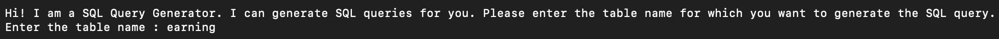
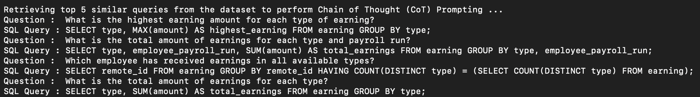

# text2sql-LLM
<br>
Leveraging In-Context Learning using a Synthetic Dataset for Text-to-SQL Models

## Running
```
pip install -r requirements.txt
python3 src/main.py
```

## Run Through
1. Enter the Table Name of the table you want to query

*<p style="text-align: center;"></p>*

You can find the table names in ```/data/csv_files```.

2. Select if you want to enter a custom Natural Language Question or perform evaluation on the test questions of the ```data/example_queries/test_set```.

*<p style="text-align: center;"></p>*

3. Enter the Natural Language Question

*<p style="text-align: center;"></p>*

4. Retrieving the top 5 most similar questions from the synthetic dataset

*<p style="text-align: center;"></p>*

4. Generating the SQL query using Zero-Shot Prompting

*<p style="text-align: center;"></p>*

5. Generating the SQL query using Chain of Thought (CoT) Prompting

*<p style="text-align: center;"></p>*

## Methodology

TL;DR 
We used synthetic data to craft prompts to leverage In-Context Learning for Text-to-SQL models. 

The methodology consists of the following steps -
<ol>
    <li> Synthetic Data Generation - Use ChatGPT to generate synthetic data of Natural Language Questions and Corresponding SQL queries for each table.
    <li> Cosine Similarity Calculation - For the test selection, select the top 5 most similar questions to the test question from the synthetic dataset.
    <li> Chain of Thought (CoT) Prompting - Form a prompt using the top 5 most similar questions and feed it to the model to generate the SQL query.
</ol>

<br>

### Synthetic Data Generation
We used ChatGPT Web API to generate synthetic dataset of Natural Language Questions for each table using the following template - 

```
--- Prompt 1 ---
Give SQL query for the following -

Question:
<Sample Question>

Table Schema:  [*, id, remote_id .... ]
Table Name : <Table Name>

Some rows in the table looks like this:
<Row1>
<Row2>
<Row3>

--- Prompt 2 ---
Can you give me 10 different natural language questions and their corresponding SQL questions specific to this dataset in the format of a combined CSV file in the following format

Index, Question, SQL Query

The delimiter should be "|" instead of comma as a txt file 

--- Prompt 3 ---
Give me <X> more different natural language questions and the corresponding SQL queries in the same format starting from index 11 in a txt file
```

The synthetic dataset generated for each table is present in ```/data/example_queries```. The complete set folder contains the all the synthetic data
<br>

Note - X is the number of synthetic questions to be generated. I used 40 synthetic questions for each table.
For checking the syntax of the SQL queries, I ran all the queries over the table once (see: ```src/check_retr_data.py```).


### Cosine Similarity Calculation
We used the ```sentence-transformers``` library to calculate the cosine similarity between the test question and the synthetic questions generated for each table. The top k most similar questions are selected as prompts for the next step.
<br>

### Chain of Thought (CoT) Prompting
We crafted a prompt using the top 5 most similar questions as prompts to generate the SQL query. The prompt also contained information about the table schema and the table name. The prompt is then fed to the model to generate the SQL query for the test question.
<br>

### Models Tested
I tested the framework with the following models:

```
juierror/flan-t5-text2sql-with-schema
dawei756/text-to-sql-t5-spider-fine-tuned
gpt2
```

## Observations

#### <b> CoT Prompting helps the model output than Zero-Shot Prompting </b>
Empirically, I have observed that the model produces much better queries with Retrieval-based CoT Prompting than Zero-Shot Prompting.

For instance, For the question <i> How many distinct types of earnings are there? </i> for the table - earning
 
For Zero-Shot Prompting, the model outputs the following query which does not work -
*<p style="text-align: center;"></p>*

For CoT Prompting, the model outputs the following query which works well and answers the question correctly - 
*<p style="text-align: center;"></p>*

####  <b> Fine-tuned Models Outperform Pre-trained Models </b>

The models fine-tuned for text to sql task performed much better than pre-trained models. The fine-tuned models I used are -
```
juierror/flan-t5-text2sql-with-schema
dawei756/text-to-sql-t5-spider-fine-tuned
```

####  <b>  Providing Tables Schemas is not enough </b>
Some of the initial experiments I conducted involved only providing the table schemas in the prompt. In such the case, the model does not have access to the values of the columns in the table. 

To remedy this, I also tried providing some sample rows from the table in the prompt. While this did improve the results, it was not enough to generate the correct SQL query.

To further improve the results, I started providing some example queries in the prompt. This helped the model generate the correct SQL query.

#### <b> Best Results </b>
The open-source model ```juierror/flan-t5-text2sql-with-schema``` produced the best results among the models I used for API calls. However, I believe the model's performance could be further improved by incorporating OpenAI APIs, specifically by leveraging the Chain of Thought Prompts and testing them on the OpenAI Playground. This combination, which includes retrieval-based CoT prompting, schema information, samples, and OpenAI API, yielded the best SQL query generation results.

## Future Work
<ol> 
    <li> <i> Benchmarking the results </i> - Benchmarking and comparing zero-shot and CoT Prompting results on a dataset would offer stronger evidence for the effectiveness of Retrieval-based CoT Prompting, complementing the observed improvements in query formulation through empirical observations.
    <li> <i>Extending the framework for multiple table </i> - The framework currently supports single table queries, but extending it to accommodate multiple table queries would enhance its functionality.
    <li> <i> Breaking down the query formation process into smaller steps </i> - Inspired by the work of <a href="https://github.com/MohammadrezaPourreza/Few-shot-NL2SQL-with-prompting"> Few-shot-NL2SQL-with-prompting </a>, we can break down the query formation process into smaller steps and use the intermediate results to guide the model to generate the final SQL query. For example, we can prompt the model to estmate the tables that would be used in the query instead of asking the user.

</ol>


## 👪 Contributing
Pull requests are welcome. For major changes, please open an issue first to discuss what you would like to change. For any detailed clarifications/issues, please email to ndiwan2[at]illinois[dot]edu[dot].
